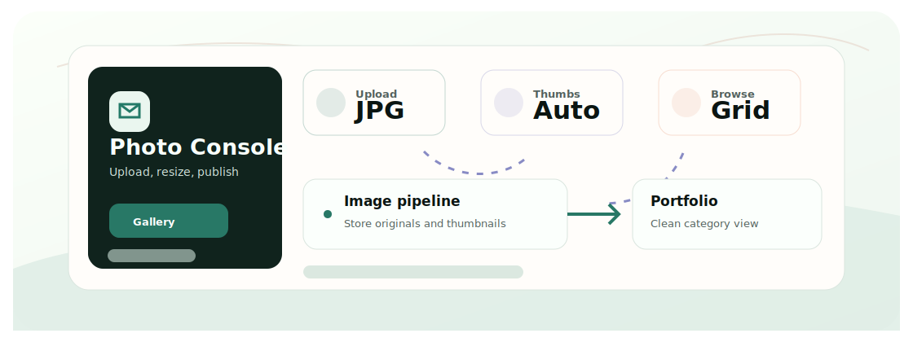

<div align="center">
  <h1>Photo Portfolio</h1>
  <p>A lightweight Flask photo portfolio with categorized galleries, thumbnails, and admin upload tools.</p>

  <p>
    <a href="README.zh-CN.md">Chinese</a>
    &middot;
    <a href="#quickstart">Quickstart</a>
    &middot;
    <a href="#tech-stack">Tech Stack</a>
  </p>

  <p>
    
    
    
  </p>
</div>

<p align="center">
  
</p>

## Why This Exists

A personal photo site should be easy to update without rebuilding the whole page. This app keeps the workflow simple: upload photos, generate thumbnails, and browse them by category.

## Quickstart

```bash
git clone https://github.com/Ha22yX/Photo-portfolio.git
cd Photo-portfolio
python -m venv .venv
.venv\Scripts\activate
pip install -r requirements.txt
python app.py
```

Open `http://127.0.0.1:5001` after the server starts.

## Features

- Category-based photo gallery for personal portfolio pages.
- Thumbnail generation with Pillow to reduce page weight.
- Admin-facing upload and management flow.
- Responsive templates for browsing photos on different screens.

## Tech Stack

| Layer | Technology | Role |
| --- | --- | --- |
| Backend | Flask | Routes, upload flow, gallery rendering. |
| Images | Pillow | Thumbnail generation and image handling. |
| Auth | Flask-Login, Werkzeug | Simple admin session and password helpers. |
| Frontend | Jinja templates | Gallery and admin pages. |


## Project Notes

This is a personal portfolio app rather than a hosted service. Configure credentials and image folders before exposing it publicly.
